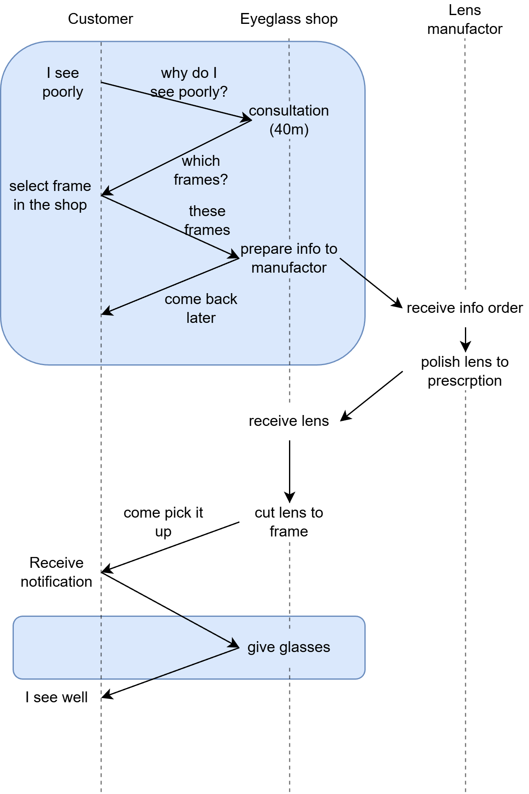
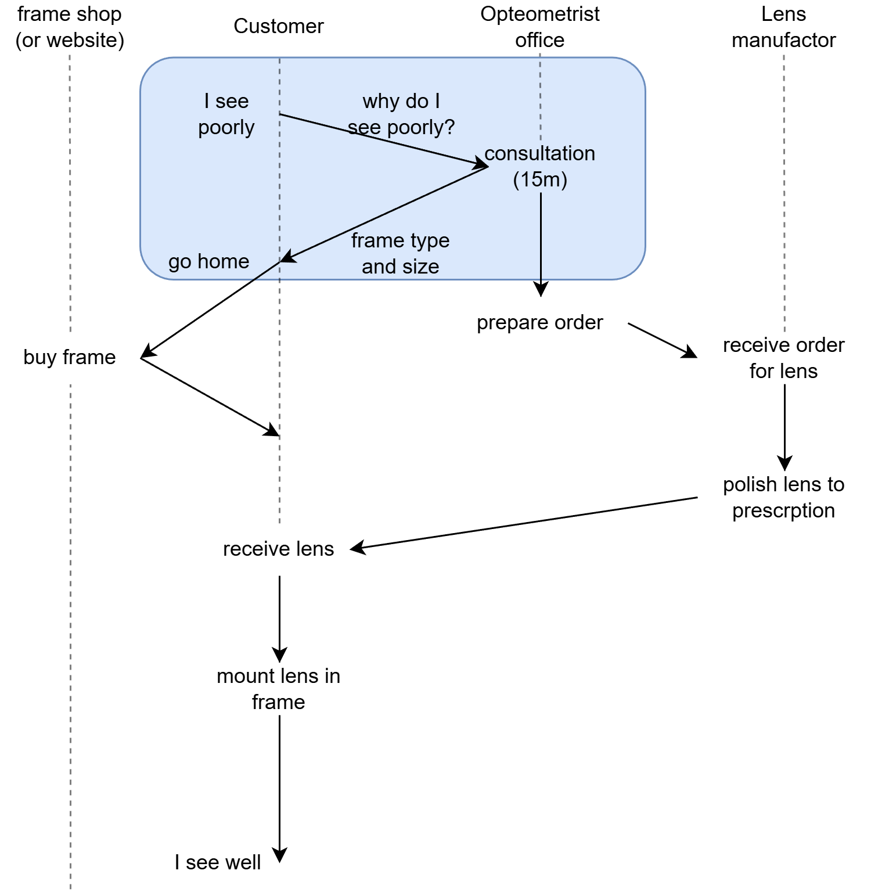

= Idea & Business Model: Universal Eyeglass Socket Initiative
:toc: left
:toclevels: 3
:sectnums:
:icons: font
:imagesdir: ../images

image::logo.svg[UES Logo,280,align="center"]

[abstract]
--
This document describes the concept behind Universal Eyeglass Socket, the market opportunity, business model, and the process for implementing a universal standard for interchangeable prescription lenses.
--

== The Core Idea

=== Problem Statement

Today's eyewear market creates several problems for consumers:

1. **High replacement costs**: When frames break, consumers must either:
   * Pay for a complete new pair (frames + new lenses)
   * Keep broken frames to preserve expensive prescription lenses
   * Wait for lens transfer, which may not always be possible

2. **Lens-frame incompatibility**: Each frame requires custom-cut lenses, making it impossible to:
   * Own multiple frame styles for the same prescription
   * Quickly replace broken frames
   * Share lenses between family members with similar prescriptions and sizes

3. **Waste and inefficiency**: Functional lenses are discarded when frames break, and functional frames cannot be used when prescriptions change

4. **Limited frame selection**: Consumers often choose frames based on availability at their optometrist rather than unlimited choice

5. **Complex logistics**: Eyeglass must align costumer's wishes, frame brands and lens manufacturers:

.Current user journey flow

=== Proposed Solution

Create an **industry-wide standard** for interchangeable prescription lenses interfaces that:

* Use a standardized lens sizes (S, M, L, XL) and shape (circular, rounded square)
* Employ a tool-free snap-fit mounting system
* Work with any Standards Glasses-compliant frame
* Can be ordered online and installed at home

=== How It Works

.New user journey flow

==== For Consumers

1. **Initial Measurement**: Visit an optometrist for:
   * Prescription measurement
   * Pupillary distance (PD) measurement
   * Face measurements to determine Eyeglass Socket size (XS/S/M/L)

2. **Lens Purchase**: Order UES lenses from:
   * Online retailers
   * Optical laboratories
   * Traditional optometrists
   * Direct from lens manufacturers

3. **Frame Selection**: Choose any UES frame:
   * Buy multiple frames for different occasions
   * Replace broken frames without replacing lenses
   * Try fashion frames without commitment

4. **At-Home Installation**: 
   * Snap lenses into frames (no tools required)
   * Takes <2 minutes per lens
   * Visual confirmation of proper engagement

==== For the Industry

===== Lens Manufacturers

* Produce lenses in standard sizes instead of fully custom
* Batch production reduces unit costs
* Potential for inventory management (common sizes stocked)
* Market opportunity in direct-to-consumer sales

===== Frame Manufacturers

* Design frames around standard apertures
* Differentiate through style, materials, and features (not lens shape)
* Lower entry barrier for new brands
* Potential subscription models (frame-of-the-month)

===== Optometrists (person)

* Focus on professional services: eye health, prescription, fitting
* Establish office without sales / front

===== Optical Labs

* Simplified production with standardized sizes
* Faster turnaround times
* Reduced waste from mis-cuts
* Higher volume potential

== Market Analysis

=== Existing Similar Concepts

Based on research, partial implementations exist:

[cols="2,3,3", options="header"]
|===
|Concept
|What Exists
|Limitations

|Modular Frames
|Dresden Vision (frame parts interchangeable)
|Proprietary, single-brand ecosystem

|Interchangeable Lenses
|Wiley-X SG-1, sports eyewear
|Frame-specific, not cross-brand

|RX Inserts
|Sports goggles, military glasses
|Limited to protective eyewear

|Trial Lenses
|Standard 38mm trial frames
|For vision testing only, not everyday wear
|===

*No universal consumer standard exists* across brands and manufacturers.

=== Why It Hasn't Been Done

1. **Fashion vs. Function Tension**
   * Eyewear is a fashion item
   * Brands differentiate through unique lens shapes
   * Standardization perceived as limiting design freedom

2. **Industry Fragmentation**
   * Thousands of frame manufacturers
   * No coordinating body for consumer eyewear standards
   * Dominated by few large companies (Luxottica, Safilo) with no incentive to standardize

3. **Optical Complexity**
   * Different frame geometries require different base curves
   * Concern that fixed sizes would compromise optical quality
   * True for extreme wraparound or highly tilted frames, but most fashion frames fall within acceptable range

4. **Patent Landscape**
   * Various patents on interchangeable lens systems
   * Creates legal uncertainty for new entrants
   * No one has published an open, royalty-free standard

=== Market Opportunity

==== Market Size

* Global eyewear market: ~$140B (2025)
* Prescription eyewear segment: ~$80B
* Average replacement cycle: 2-3 years
* Average frames-to-lenses cost ratio: 40:60

==== Target Segments

1. **Cost-Conscious Consumers** (Primary)
   * Sensitive to replacement costs
   * Value versatility (multiple frames)
   * Comfortable with online purchasing

2. **Fashion-Forward Users** (Secondary)
   * Want multiple frame styles
   * Willing to pay for flexibility
   * Early adopters of new technology

3. **Active/Outdoor Users** (Tertiary)
   * Need durable, replaceable solutions
   * Existing sports eyewear familiarity
   * Value quick replacement capability

4. **Sustainability-Minded** (Emerging)
   * Concerned about waste
   * Prefer repair over replace
   * Align with circular economy values

5. **Children in Low-Income Families and Developing Countries** (High-Impact)
   * Uncorrected vision is one of the leading causes of poor school performance in children
   * A single optometry consultation is sufficient — lenses can be reused indefinitely as the child changes frames due to growth or damage
   * NGOs, school programs, and public health systems can stock standard lenses for immediate distribution
   * Dramatically lowers the cost-per-corrected-child compared to fully custom eyewear

==== Value Proposition for Humanitarian and Pediatric Use

Uncorrected refractive errors affect an estimated 1 billion children worldwide, with the majority in low- and middle-income countries.
Cost and logistics are the primary barriers: a single pair of custom glasses is unaffordable for many families, and re-glazing when a child's frame breaks requires a new consultation and new cut lenses.

With UES:

* A child is measured once — the prescription determines the UES size.
* Lenses are produced in batch at low cost and can be pre-positioned in schools or clinics.
* When the frame breaks, only the frame is replaced — at a fraction of the total cost.
* Donated or subsidised lens stock (stocked by size code) can serve many children with no individual manufacturing lead time.

This makes UES a natural fit for school eye-health programs, NGO distribution, and government public-health procurement.

==== Value Proposition for Individual Consumers

For a consumer with a $200 prescription:

*Traditional Model*:
[source]
----
Year 1: Frame ($100) + Lenses ($200) = $300
Year 2: Frame breaks, replace ($100 + $200) = $300
Total: $600
----

*UES Model*:
[source]
----
Year 1: UES Frame ($80) + UES Lenses ($180) = $260
Year 2: Frame breaks, replace frame only ($80) = $80
Total: $340

Savings: $260 (43%)
PLUS: Option to own multiple frames for same lens cost
----

== Business Model

=== Open Standard with a non-profit backing

The UES initiative operates as an **open, royalty-free specification**:

* legally protected by a non-profit
* Specification published publicly
* license to use under conditions of trademark protection

=== Risks and Mitigation

==== Patent Infringement

*Impact:* High — could block the entire project.

Existing patents on interchangeable lens systems create legal uncertainty.
A thorough freedom-to-operate (FTO) analysis must be conducted before publication.
Where blocking patents are found, the design should be adapted to work around them.
Proactive defensive publication of the specification creates prior art and prevents future patent encumbrance by third parties.

==== Industry Resistance

*Impact:* High — no adoption means failure.

Large incumbents (Luxottica, Safilo) have no financial incentive to standardize and may actively resist.
The strategy is to begin with independent frame and lens manufacturers who stand to gain from a level playing field.
Demonstrating real consumer demand and cost savings early builds the case for broader adoption.
An open, royalty-free model removes the main commercial objection.

==== Optical Quality Concerns

*Impact:* Medium — could limit adoption or credibility.

Optometrists and lens manufacturers may argue that fixed sizes compromise prescription accuracy, particularly for high-power or custom base-curve requirements.
Mitigation requires rigorous independent testing across a range of prescriptions, and early engagement with optometric associations to define acceptable tolerances within the specification.

==== Consumer Skepticism

*Impact:* Medium — risks slow initial adoption.

Consumers accustomed to fully custom lenses may distrust a standardized system.
Pilot programs with money-back guarantees lower the perceived risk.
Endorsements from independent optometrists and sustainability advocates help build credibility.
Clear installation demonstrations (video, in-store) reduce friction at the point of purchase.

==== Manufacturing Complexity

*Impact:* Low — may increase unit cost marginally.

Introducing a new interface geometry adds tooling requirements for manufacturers.
This is mitigated by involving manufacturers early in the specification process so tolerances are achievable with existing production lines.
The long-term volume benefits of batch production outweigh the initial tooling cost.

==== Competing Standards

*Impact:* Medium — market fragmentation would undermine the network effect.

A rival proprietary standard from a large brand could split the market.
First-mover advantage is critical: publishing an open specification quickly establishes prior art and a reference implementation.
Open licensing and an inclusive governance model make it unattractive for competitors to fork a separate standard.

_See link:../spec/technical-spec.adoc[Technical Specification] for detailed standards._
