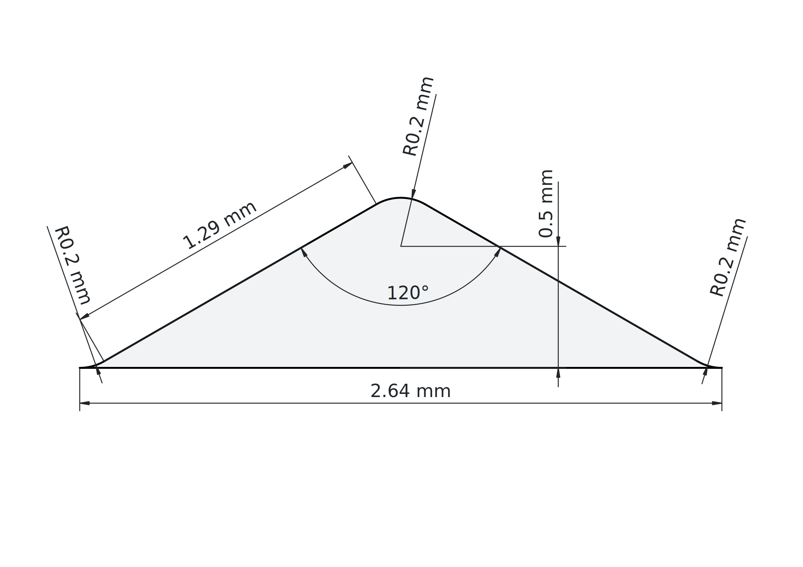

= Technical Specification: Universal Eyeglass Socket Interface
:doctype: article
:toc: left
:toclevels: 4
:sectnums:
:icons: font
:imagesdir: diagrams
:revnumber: 0.9
:revdate: 2026-04-25
:revremark: Draft for public review
:xrefstyle: full

image::logo.svg[UES Logo,280,align="center"]

[abstract]
--
This document is the normative technical specification for the Universal Eyeglass Socket (UES) interface.
It defines the mechanical geometry of the lens bevel ridge, the frame rim bevel groove, lens sizes, bridge widths, material requirements, environmental durability requirements, and marking rules.
Any lens or frame rim that conforms to this specification and passes the conformance tests may claim UES compliance.
--

''''

*Specification Editors* +
Universal Eyeglass Socket Implementation Forum (UES-IF) +
Rua Elias Garcia 253, 4E, 2700-666 Amadora, Portugal

*Copyright Notice* +
Copyright © 2026 Universal Eyeglass Socket Implementation Forum.
The technical content of this specification is published under the terms of the Creative Commons Attribution 4.0 International Licence (CC BY 4.0).
Logo and trademark rights are governed separately by the UES-IF Trademark/Logo Licence Agreement.

''''

== Introduction

=== Purpose

This specification exists to enable a market in interchangeable prescription lenses.
When every compliant lens and every compliant frame rim implement this mechanical interface, a consumer can:

* own multiple frames in one size and swap lenses between them at home without tools;
* replace a broken frame without discarding functional lenses;
* order lenses online and receive them ready to self-install.

=== Scope

This specification normatively defines:

. The contour model - a UES aperture outline as a list of control points of a cubic Bézier curve, shared by both lens body and frame rim aperture.
. Size codes (XS and S) that scale:
.. the box size
.. the bridge width of the frame
.. the horizontal and vertical curvature of the aperture contour
. The bevel ridge on the lens edge and the matching bevel groove on the frame rim inner wall
. The clearance on the frame to allow lens with different thickness to fit without prescription-specific rim geometry
. Material requirements for the bevel zone of both product types.
. Surface finish requirements in the bevel zone.
. Environmental and durability requirements (temperature, humidity, UV, insertion/removal cycle life).

NOTE: Conformance test procedures and compliance declaration requirements are defined in the companion link:compliance-test.adoc[UES Compliance Test Procedures] document.

The following are outside scope:

* Optical prescription values, coatings, tints, and UV absorption - these remain entirely at the discretion of the lens manufacturer.
* Frame materials, temple styles, nose pad design, hinge mechanisms, and all other frame geometry not at the rim aperture.

=== Conventions

==== Precedence

In the case of conflict between this specification and a normative reference document, this specification takes precedence for the UES bevel interface.
All other aspects of ophthalmic standards apply as-is.

==== Keyword Definitions

The following keywords appear throughout this document with precise normative meaning:

*SHALL* — An absolute requirement.
A product that does not satisfy a SHALL requirement is not UES-compliant, regardless of any other properties.

*SHALL NOT* — An absolute prohibition.

*SHOULD* — A recommended practice.
Deviation is permitted only when the implementer can demonstrate that the overall compliance goal is met by an alternative approach.

*SHOULD NOT* — A recommended prohibition.

*MAY* — An optional feature or practice.
Absence of the feature does not affect compliance.

*[informative]* — Text marked [informative] does not create normative requirements.
It is included to aid understanding.

==== Units and Numbering

Dimensions are in millimetres (mm) unless otherwise stated.
Angles are in degrees (°).
Forces are in Newtons (N).
Temperatures are in degrees Celsius (°C).
Surface roughness is in micrometres (µm).

=== Terms and Definitions

Bevel groove:: The V-shaped groove present continuously around the full inner (aperture) wall of a UES-compliant frame rim; the female mating feature of the interface.

Bevel ridge:: The V-shaped ridge formed continuously around the full perimeter of the edge of a UES-compliant lens; the male mating feature of the interface.

Bevel zone:: A fixed-width axial band at the anterior (observer-facing) face of the lens edge, extending posteriorly from the anterior face, within which the bevel ridge is formed; the flat land areas on each side of the ridge base lie on a common surface of constant offset from the aperture contour, following the aperture curvature of the declared size code. Also, the corresponding annular region of the frame rim inner wall that carries the bevel groove.
The bevel zone width is the same regardless of prescription-driven lens body thickness. The lens body inboard of the bevel perimeter may extend posteriorly beyond the bevel zone to accommodate prescription thickness.

[[boxing_a_dimension]]
Boxing width (A):: The horizontal width of the minimum axis-aligned bounding rectangle enclosing the lens aperture contour, as defined in the boxing system of ISO 8624 §5.
This is the *lens size number stamped on spectacle temples* (the "D" value in everyday parlance and optical trade literature).
See also: <<effective_diameter,Effective diameter (ED)>>.

[[boxing_centre]]
Boxing centre:: The geometric centre of the minimum axis-aligned bounding rectangle enclosing the lens aperture contour, as defined in the boxing system of ISO 8624 §5.
If A is the horizontal width and B is the vertical height of the bounding rectangle, the boxing centre is the point at horizontal distance A/2 from each vertical side and vertical distance B/2 from each horizontal side.
It is distinct from the optical centre and from the fitting/reference point; the signed horizontal distance from the boxing centre to the fitting/reference point is the decentration Dec.

Bridge width:: The clear distance between the inner nasal edges of the two lens rims, measured horizontally at the datum plane defined in ISO 8624 §5.

Clearance fit:: An assembly condition in which the groove dimensions exceed the ridge dimensions by a defined amount, ensuring the lens can be inserted and removed by hand. In the UES interface, this applies to the V-groove/ridge pair only; the outer cylindrical surface of the lens edge is a sliding fit against the rim channel inner wall.

Sliding fit:: An assembly condition in which two mating cylindrical surfaces share the same nominal diameter, so that the parts can slide together without force but with negligible radial play. In the UES interface, the lens flat land outer surface slides against the rim channel inner wall, providing radial centring.

Compliant lens:: A lens that satisfies all normative requirements of this specification for the lens role.

Compliant frame rim:: A frame rim that satisfies all normative requirements of this specification for the frame rim role.

Datum plane:: The vertical plane parallel to the lens front surface, passing through the horizontal centreline of the lens, as defined in ISO 8624.

Fully seated:: The condition in which the bevel ridge apex contacts the bevel groove apex along the entire perimeter and the lens front surface is flush with the frame rim front face.

Rim channel:: The annular recess in the frame rim that receives the lens edge including the bevel ridge; the bevel groove is cut into the inner wall of this channel.

Size code:: A one or two letter identifier (e.g. "XS") of the lens boxing width A (see <<boxing_a_dimension>>).

Shape code:: A one or two letter identifier (e.g. "C") of the lens contour shape.

Product code:: A designator of the form UES-TT-SS, where TT is a one- or two-letter shape-type identifier (e.g., C for Circular) and SS is a size code (e.g., XS, S), that uniquely identifies a lens shape and physical scale; two products are mechanically compatible if and only if they carry the same product code.

Control point:: One of the ordered points P₀, P₁, … that define a UES looped cubic Bézier contour; see <<_contour_model>>.

[[effective_diameter]]
Effective diameter (ED):: The lens blank size metric defined in ISO 8624 using the boxing system: stem:[\mathrm{ED} = \sqrt{\left(\frac{A}{2} + \mathrm{Dec}\right)^2 + \left(\frac{B}{2}\right)^2}], where A is the <<boxing_a_dimension,boxing width>>, B is the vertical height of the minimum axis-aligned bounding rectangle, and Dec is the horizontal decentration.
Do not confuse ED with the UES size parameter, which is the boxing width A (see <<size-table>>).

Unit shape:: An aperture contour expressed in normalized coordinates such that (a) the boxing centre is at the origin (Dec = 0) and (b) the <<boxing_a_dimension,boxing width A>> is equal to 2 (i.e. on-curve endpoints span x ∈ [−1, +1]).

== System Overview

=== Role of the UES Interface

[informative]
The UES interface is the sole point of mechanical coupling between a lens and a frame rim.
It is intentionally defined as a single, simple V-bevel feature so that:

* lenses and rims can be manufactured by independent parties without coordination beyond this specification;
* installation requires no tools, no adhesive, and no fasteners;
* the interface self-centres the lens during installation by the geometry of the V-groove.

=== Products impacted

This specification governs two parts of two product types:

*Lenses geometry and groove* — the bevel ridge on the lens edge, together with the normative requirements on lens edge geometry in the bevel zone.

*Frame rim geometry and groove* — the bevel groove on the frame rim inner wall, together with the normative requirements on rim geometry in the bevel zone and rim aperture.

=== Interchangeability Model

A compliant lens of product code UES-TT-SS SHALL mate with any compliant frame rim of the same product code.
A compliant lens of product code UES-TT-SS SHALL NOT be expected to mate with a frame rim of a different product code.

[[_contour_model]]
== Contour Model

=== Overview

All UES aperture shapes are defined as *looped cubic Bézier curves* in a normalized coordinate system.
This single contour governs both the lens body outline and the frame rim aperture opening.
This decouples shape geometry from physical size: the shape is specified once as a unit shape with a normalised <<boxing_a_dimension,boxing width A>> of 2 (on-curve endpoints at x = ±1), and the size codes in <<_size_catalogue>> scale it to produce physical dimensions.

=== Coordinate System and Normalization

The coordinate system for unit shapes is:

* Origin at the <<boxing_centre,boxing centre>> of the aperture contour (ISO 8624 §5 boxing system).
* X-axis: horizontal, positive toward the temporal side (toward the wearer's right for the right lens).
* Y-axis: vertical, positive toward the superior (top) direction.

All unit shapes in the catalogue are defined for the *right lens*.
The left lens unit shape is obtained by reflecting the right lens shape about the Y-axis: replace each control point (x, y) with (−x, y).
The reflected contour remains counter-clockwise when viewed from the front.

A *unit shape* is an aperture contour expressed in normalized coordinates such that:

* The <<boxing_centre,boxing centre>> of the contour lies at the origin (Dec = 0); and
* The <<boxing_a_dimension,boxing width *A*>> is 2 (i.e. on-curve endpoints span x ∈ [−1, +1]).

A shape code identifies a particular unit shape via an ordered list of control points in this normalized coordinate system.

.UES aperture contour coordinate system and normalization
image::coordinates.drawio.png[UES aperture contour coordinate system and normalization,600,align="center"]

=== Looped Cubic Bézier Representation

A UES aperture contour is defined by an ordered list of M = 3N control points P₀, P₁, …, P_{M−1}, forming N cubic Bézier segments.

Segment i (i = 0 … N−1) is the cubic Bézier curve:

  Bᵢ(t) = (1−t)³ P_{3i}
        + 3(1−t)² t  P_{3i+1}
        + 3(1−t) t²  P_{3i+2}
        + t³         P_{(3i+3) mod M},   t ∈ [0, 1]

The control point sequence SHALL be ordered *counter-clockwise* when viewed from the front of the lens (positive-Y-superior convention).
The contour is closed.
The last segment (i = N−1) ends at P_{(3N) mod M} = P₀ — no repeated point is stored; the closure is implicit in the modular indexing.

[informative]
In a cubic Bézier segment, P_{3i} and P_{(3i+3) mod M} are the on-curve endpoints (the curve passes through them), and P_{3i+1} and P_{3i+2} are the off-curve handle points that shape the segment without being on the curve.

[[shape-catalogue]]
=== Shape Catalogue

Each shape in the catalogue is defined by its shape code, representing an ordered list of M = 3N control points in the normalized coordinate system of <<_coordinate_system_and_normalization>>.
The control points fully determine the unit shape.

==== Circular

Shape code: *C*

[cols="^1,^1,^1", options="header"]
|===
|Index |X |Y

|0 |0 |0.9
|1 |-0.35 |0.9
|2 |-1 |0.8
|3 |-1 |0.25
|4 |-1 |-0.15
|5 |-0.8 |-0.9
|6 |0 |-0.9
|7 |0.65 |-0.9
|8 |1 |-0.35
|9 |1 |0.25
|10 |1 |0.65
|11 |0.4 |0.9
|===

==== Progressive Lens Clearance

[informative]
Every shape in the UES catalogue is designed so that progressive prescription lenses can be surfaced within any UES aperture.
Specifically, for every shape code and every size code, the vertical distance from the <<boxing_centre,boxing centre>> to the lowest point of the scaled aperture contour is at least *18.0 mm*.

This property is verified for each shape at the time it is admitted to the catalogue.

[[_size_catalogue]]
=== Size Catalogue

Size codes specify the lens diameter and bridge width.
All dimensions are nominal.

[[size-table]]
[cols="1,1,1", options="header"]
|===
|Size Code
|Boxing Width A (mm)
|Bridge Width (mm)

|XS
|43.0
|15.0

|S
|47.0
|17.0
|===

[[_aperture_curvature]]
=== Aperture Curvature

The UES aperture contour is not flat; it lies on an ellipsoidal surface whose curvature is fixed for each size code.
Two radii, measured from the midpoint of the bridge, define this surface:

Centre of curvature:: The single reference point from which both Rx and Rz are measured.
It is located at the midpoint of the bridge, in the datum plane (the vertical plane at the horizontal centreline of the lenses).
Because both radii share this point, the aperture surface of each lens is a patch of an ellipsoidal surface centred at the bridge midpoint, so the lens pair follows the curvature of the wearer's face.

Rx (horizontal radius):: Distance from the centre of curvature to the aperture surface, measured in the horizontal plane.
A smaller Rx produces a more pronounced temporal wrap.

Rz (vertical radius):: Distance from the centre of curvature to the aperture surface, measured in the vertical plane through the centre of curvature.
A smaller Rz produces a more pronounced vertical (pantoscopic) wrap.

NOTE: [informative] Curvature is size-code dependent because a larger aperture subtends a greater arc of the face; fixing the radii per size code keeps the lateral and vertical wrap angles consistent across frame sizes.

NOTE: [informative] Because the left lens contour is the horizontal mirror of the right lens (see <<_coordinate_system_and_normalization>>), the horizontal curvature wraps in the opposite direction for the left lens relative to the right lens. Rx and Rz are the same values for both lenses.

.Top view of the Aperture Curvature. The contour is curved at the bottom of the shape, with the bridge center at the center of the half elipsoid.
image::curvature-top.svg[Aperture Curvature Top View,600,align="center"]

[[curvature-table]]
[cols="1,1,1", options="header"]
|===
|Size Code
|Rx (mm)
|Rz (mm)

|XS
|TODO
|TODO

|S
|TODO
|TODO
|===

The lens body SHALL be curved to match Rx and Rz for its declared size code.
The frame rim aperture SHALL present the same Rx and Rz for its declared size code, so that the lens edge lies flush against the rim channel inner wall around the full perimeter.

NOTE: [informative] Rx and Rz are measured from the shared centre of curvature at the bridge midpoint.
The local radius of curvature of the rim channel inner wall varies around the perimeter because the aperture is not circular; the values in <<curvature-table>> are the principal-plane radii from the bridge midpoint and serve as the reference for tooling setup and measurement.

== Lens Edge Geometry

[[_lens_outline]]
=== Lens Edge Outline

The physical edge outline (without the ridge) of the lens is derived from the unit shape of the declared shape code (see <<shape-catalogue>>) and the boxing width A of the declared size code (see <<size-table>>) as follows:
multiply the x- and y-coordinates of every control point in the unit shape by A/2 (in millimetres).

The lens body SHALL conform to this scaled outline.

[[_bevel_ridge]]
=== Bevel Ridge

A symmetrical V-shaped ridge SHALL run continuously around the full perimeter of the lens contour.
The ridge normal SHALL NOT bend based on the contour's curvature and SHALL be co-planar with the xy plane.

.Cross section view of the bevel ridge

[[_frame_rim_geometry]]
== Frame Rim Geometry

[[_rim_aperture_outline]]
=== Rim Aperture Outline

The shape of the rim aperture opening SHALL conform to the scaled contour of the declared product code: the same unit shape (see <<shape-catalogue>>) scaled by the lens diameter D of the declared size code (see <<size-table>>).

The rim aperture diameter is measured at the entrance plane of the rim channel, before the groove.
The rim aperture SHALL conform to this outline.

[[_bevel_zone_width]]
=== Bevel Zone Width

The lens edge SHALL present a fixed-width axial band — the bevel zone — of nominal axial width *2.64 mm* at the anterior face of the lens edge, and MAY extend posteriorly from the anterior face.
Within the bevel zone, the flat land areas on each side of the bevel ridge base SHALL lie on a common surface of constant offset from the aperture contour, following the aperture curvature (Rx, Rz) of the declared size code (see <<_aperture_curvature>>).

=== Edge Face Perpendicularity

The outer cylindrical face of the lens edge (the surface on which the bevel ridge is formed) SHALL be perpendicular to the lens plane within 2°.

[[_rim_channel_width]]
=== Rim Channel Width

The inner wall of the frame rim aperture SHALL present a fixed-width axial channel — the rim channel — of nominal axial width *2.84 mm* at the anterior face of the rim, extending posteriorly from the anterior face.
Within the rim channel, the flat land areas on each side of the bevel groove opening SHALL lie on a common surface of constant offset from the aperture contour, following the aperture curvature (Rx, Rz) of the declared size code (see <<_aperture_curvature>>).

The outer border profile of the frame rim SHALL follow the same contour as the lens body outline for the declared size code.
The frame border cross-section geometry is identical to the lens edge geometry in the bevel zone.

[[_frame_rim_clearance]]
=== Clearance for Lens Extrusion

A compliant frame rim SHALL provide sufficient axial clearance on the eye-facing (posterior) side of the rim channel to accommodate lens extrusion inwards toward the eye.
This clearance is required because high-prescription (thick) lenses extrude significantly beyond the frame plane on the posterior side.

The posterior clearance depth SHALL be no less than *4.00 mm* measured axially from the posterior end of the rim channel toward the posterior face of the rim.

NOTE: This requirement ensures that a thick lens does not contact the frame body before the bevel ridge is fully seated in the bevel groove.
It does not constrain the external (anterior) profile of the frame.
